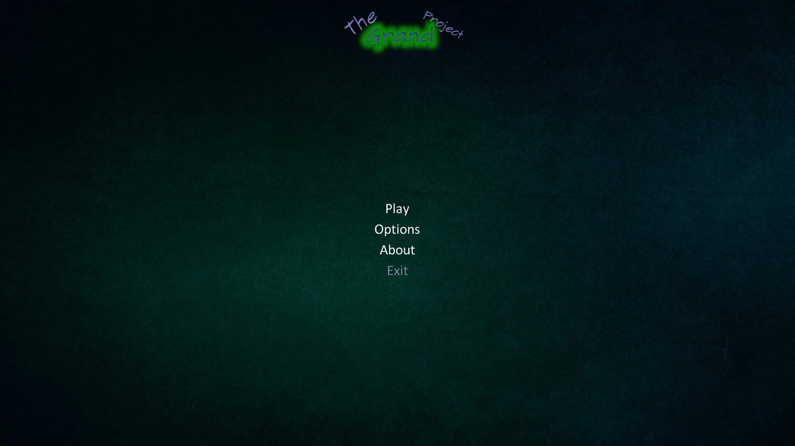
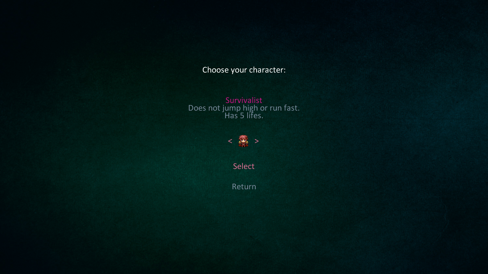
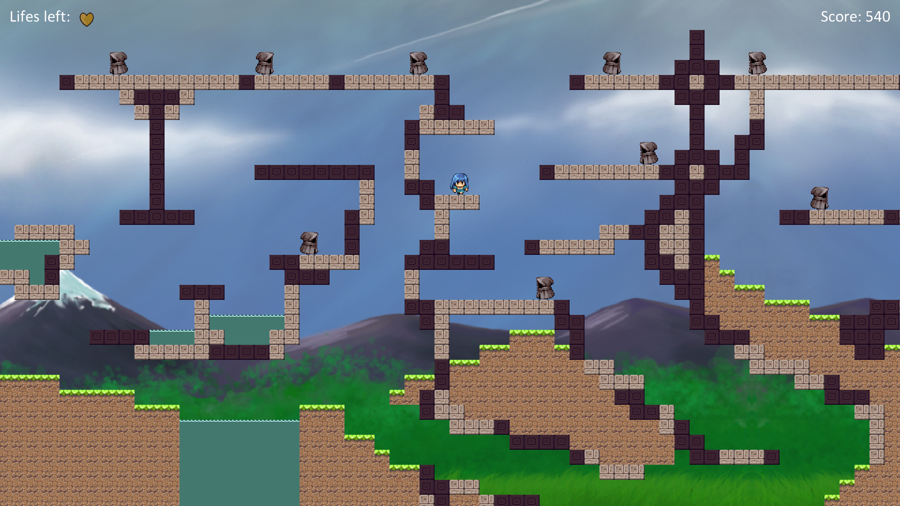
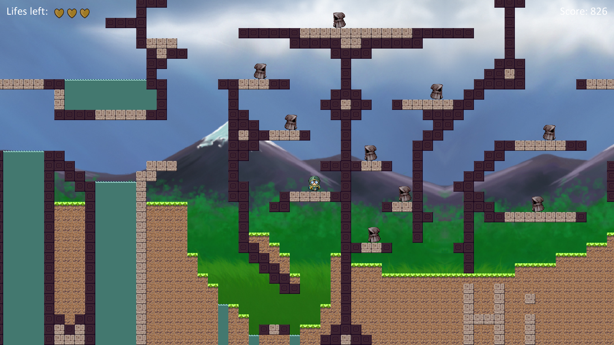

# The Grand Project

This project is a recreation of my final project for the XNA course at [NKKM](http://www.nkkm.lt/) computer school.
It was my last course in that school where I have studied 3 years and learned many new things about programming.
Besides it being the last project that I have made in that school, it was also the first one in which I have put significant effort.
Thus I have named it "The Grand Project", signifying the end of one thing and the beggining of another.

## Gameplay

TGP is a simple platformer where your objective is to get to the end tile.

+ On your way to the finish you will encounter obstacles like water and ghosts.
+ You can kill ghosts by jumping on top of them, which yields extra points.
+ There are 4 characters with different abilities to choose from. Some even get shortcuts on the map.
+ There are 5 difficulties which control the speed of ghosts and the amount of points you get for killing them.

## Controls

+ `A` - Move left
+ `D` - Move right
+ `Space` - Jump
+ `R` - Respawn
+ `Esc` - Exit to menu

## Screenshots

 | 
:---:|:---:
Main menu | Character selection
 | 
Gameplay 1 "Tryhard" character | Gameplay 2 "Leaper" character
